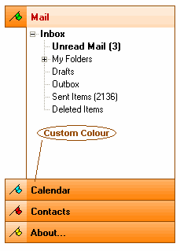



## Phantom Panel Selector \(Updated 17/07/2005\)

### Description

A Fully Owner Drawn Dependency Free Side Panel Selector Control, With Three Different Drawing Styles: Standard, StandardX And Simulated MSN Messenger Styles.

Various Options Include: Show Tooltips,Tooltip Style, Custom Color, Left To Right Support etc...

Add Different Controls To Each Panel.

Thanks Goto: Vlad For His Drawing Class and Paul Caton For His Awesome subclassing Code.

Take A Look At The Screen Shot I think It Speaks For Its Self.

As Always Constructive Comments And Critisims Are Welcome.

Gary.

----

Updated:12/07/2005

- Added Mask Color For Icons/Pictures

- ReStructured The Messenger Style Drawing Routine.

- Messenger Style Panel Rect Bug Fix.

----

Updated: 15/07/2005

Minor Cosmetic Changes: When In Messenger And Standard Drawstyle The Bottom Righthand Of The Control Was Missing A Pixel.

Embedded Control Height Was Wrong Height, When In Messenger Draw Style (Height Was Not To Exact Scale When You Resized The Icons)

Cleaned Up Code A little And Set Version to V1.02

----

Updated: 17/07/2005 : Very Minor Change, Changed The Transparent Backcolor Of The Selected Panel.

When Drawing In Messenger Style. (Thanks Goto

Riccardo Cohen For Pointing Out This Bug)

----

 
### More Info
 

             |
---                |---
**Submitted On**   |2005-07-17 22:52:04
**By**             |[Phantom Man](https://github.com/Planet-Source-Code/PSCIndex/blob/master/ByAuthor/phantom-man.md)
**Level**          |Advanced
**User Rating**    |5.0 (224 globes from 45 users)
**Compatibility**  |VB 5\.0, VB 6\.0
**Category**       |[Custom Controls/ Forms/  Menus](https://github.com/Planet-Source-Code/PSCIndex/blob/master/ByCategory/custom-controls-forms-menus__1-4.md)
**World**          |[Visual Basic](https://github.com/Planet-Source-Code/PSCIndex/blob/master/ByWorld/visual-basic.md)
**Archive File**   |[Phantom\_Pa1914467172005\.zip](https://github.com/Planet-Source-Code/phantom-man-phantom-panel-selector-updated-17-07-2005__1-61638/archive/master.zip)

